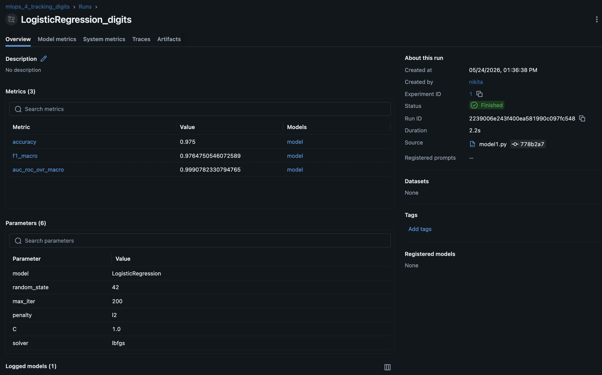
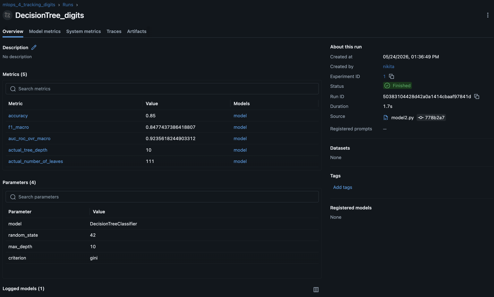
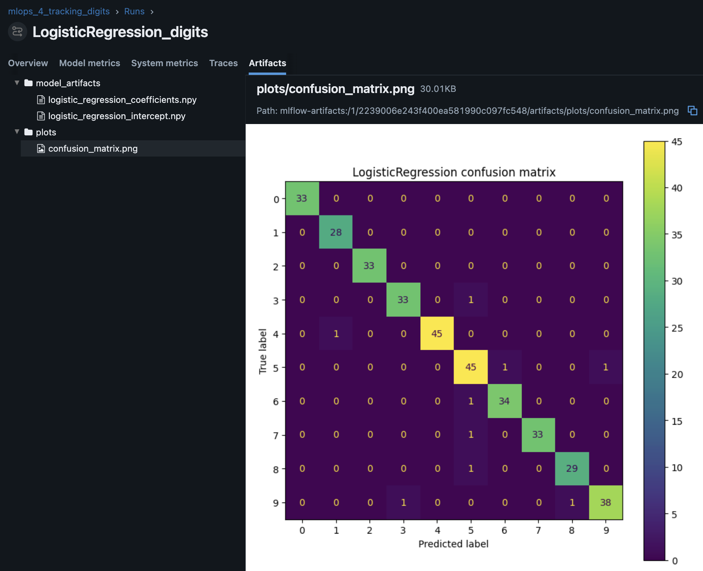
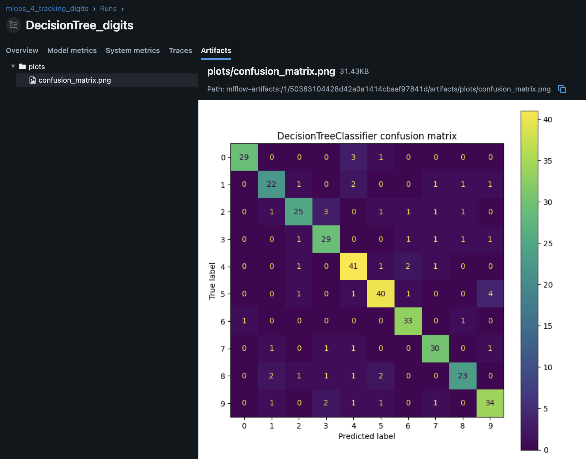

## Homework 1: ClearML

В рамках задания были обучены две модели на датасете Digits:

- `LogisticRegression`
- `DecisionTreeClassifier`

Для обеих моделей в ClearML логируются:

- параметры модели;
- `accuracy`;
- `f1_macro`;
- `auc_roc_ovr_macro`;
- `confusion_matrix`.

Для `LogisticRegression` дополнительно сохраняются артефакты:

- коэффициенты модели;
- свободный член модели.

Для `DecisionTreeClassifier` дополнительно логируются:

- фактическая глубина дерева;
- фактическое количество листьев;
- критерий разбиения.

### ClearML experiments

- LogisticRegression: https://app.clear.ml/projects/04b013ccf45d409dbbcca65b2cbf203a/experiments/4029403fdf9d4e1c9c4415c6e61323cc/output/execution
- DecisionTreeClassifier: https://app.clear.ml/projects/04b013ccf45d409dbbcca65b2cbf203a/experiments/8939fe689fda40acba42fbad51094d41/output/execution

### Environment note

Для запуска использовался Python 3.14, поэтому версия `scikit-learn` была обновлена до совместимой версии `scikit-learn>=1.7.2`.

## Homework 2: MLflow

В рамках задания были обучены две модели на датасете Digits:

- `LogisticRegression`
- `DecisionTreeClassifier`

MLflow Tracking Server запускался локально:

```bash
mlflow server --host 127.0.0.1 --port 5000


Если сделаешь скриншоты artifacts, добавь ещё:

```md
### Overview





### Artifacts



